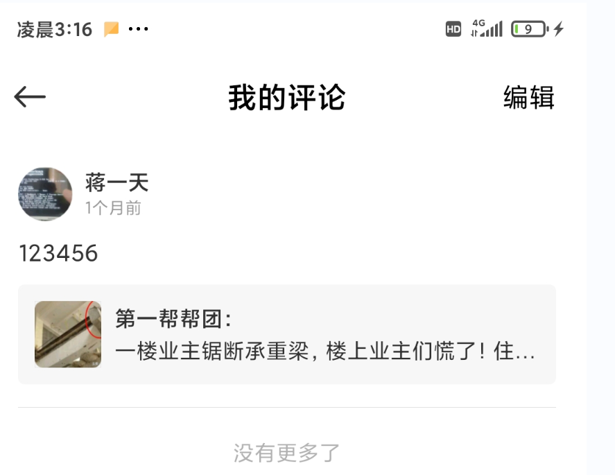

# 目录

[业务架构](#业务架构)

[系统架构](#系统架构)

[项目进度](#项目进度)

[部署](#部署)

[接口文档](#接口文档)


# 业务架构

### 一、原型

　　借鉴微信朋友圈、小米内容中心、微博

### 二、数据库设计

#### 应该如何设计

- 用户行为分析 

  　　用户可以发文章、给文章写评论、给文章点赞、给评论点赞、回复评论。

- 设计原则
  
  　　　　从最细粒度的表开始设计，因为你想想，如果从最宏观的用户表开始设计，改如何设计，根本就没法设计，表的设计应该是从下往上的。
  
  　　从用户行为分析可以看出一共分为两层，用户单独作为第一层，文章、评论、赞这几个是同级的，作为第二层，从第二层开始设计。
  
  　　当然，这里面只有两层，如果有三层或者三层以上，得从最下面的一层开始设计。

#### 表字段的确定

　　任何一张表均由两部分构成：这张表所要表达的内容、这张表和其他表的关系，既然从第二层开始设计，咱们就开始一张一张的来。

- article表：

   要表达的内容：文章的内容

   和其他表的关系：一篇文章属于某个用户，所以这里新建user_id字段用来表示这篇文章是哪一个用户发的

- comment表：
  
  要表达的内容：谁对谁进行评论，这就需要from_user_id、to_user_id、content三个字段,这里to_user_id如果为null就是对文章本身进行评论

  和其他表的关系：评论是对文章的的评论，新建article_id字段用来表示这段评论属于哪一篇文章
  
- like表:
  
  要表达的内容：无 这里没有什么内容要表达，因为，从界面上来说没有要显示的内容，上面的article表和comment表都有要显示的内容
  
  和其他表的关系：某人对某篇文章或者某条评论进行了点赞，所以新建user_id、article_id、comment_id三个字段来得知：是谁进行了点赞，是对哪一篇文章进行了点赞或者对哪一个评论进行了点赞

#### ER图


注： .ndm2文件： https://yitianjiang-circle.oss-cn-beijing.aliyuncs.com/circle-v2.ndm2

用navicat打开

#### 主键选取

　　<span style="color:red;">id不使用数据库自增id</span>，当业务数据增长到一定程度的时候，为了保证数据库的查询性能，将会面临分库分表，这时如果使用的是数据库的自增id，将会导致id重复，分库分表无法进行，因此一个全局唯一、趋势递增的id是有必要的。

　　这里使用的是leaf，并对其进行了rpc调用改造。

　　leaf地址：https://github.com/Meituan-Dianping/Leaf

　　leaf官方设计文档：https://tech.meituan.com/2017/04/21/mt-leaf.html

#### 查询优化

　　参照《 阿里巴巴java开发手册 索引规范》：https://blog.csdn.net/qq_28959087/article/details/103555362 对查询进行了优化


### 三、缓存

　　这里使用redis，比如做<span style="color: red;">用户信息缓存、搜索关键词排名</span></span>。

　　mysql5.7也有查询缓存，但是

　　1. 写多的时候对mysql的性能会有影响

　　2. 任何对表的修改都会导致与这张表相关的所有缓存失效，这意味着对一篇文章的修改会导致其他所有文章的缓存失效，这是业务所不能忍受的。

　　mysql8.0已经废弃了查询缓存，所以这里用redis来缓存数据。

参考：

[1] [MySQL 8.0: Retiring Support for the Query Cache](https://mysqlserverteam.com/mysql-8-0-retiring-support-for-the-query-cache/)

[2] [MySQL查询缓存](https://cloud.tencent.com/developer/article/1579788?from=14588)


### 四、mongodb

　　这里将用户的文章浏览记录用mongodb来储存。

　　**为什么使用mongodb**:   首先业务场景是：写得很多，读得很少。用户很少去看自己的文章浏览记录，在首页上不停地刷文章，而每点进一篇文章详情，就要插入一条浏览记录。另外还存在以下一点: 

　　在大量数据写入时，mongodb采用了内存作为缓冲，不指定_id的写入性能约为mysql的两倍<sup>[1]</sup>。

　　所以这里用了mongodb。(mysql更适用于，有join操作，要使用事务的场景)

参考：

[1] [MongoDB与MySQL的插入、查询性能测试](https://www.cnblogs.com/liaocheng/p/4237091.html)


# 系统架构


## 授权和认证

### 一、方案选型

有以下二种种方案可供选择：

1. 传统的cookie、session机制

   缺点：

   - 第三方网站假冒用户，携带用户cookie访问己方站点，从而使己方站点遭受攻击<sup>[1]</sup>（csrf），虽然预防csrf有很多种方案，比如验证码、加token<sup>[2]</sup>,但是无疑增加了前端实现复杂度。
   - session存在服务端内存中，当用户数目多的时候，占的内存多，对服务端造成的压力大<sup>[3]</sup>。
   - 移动端对 cookie 的支持不是很好，session又需要基于 cookie 实现。
   - 分布式架构下的session共享问题（这也不算问题，有spring-session这样的解决方案可供选择）。
   - cors配置不能阻止csrf的发生<sup>[4]</sup>，虽然ajax请求有同源限制，但csrf可以通过表单提交，而不是ajax进行。

2. jwt

   优点：

   - 针对上面第一条缺点：不使用cookie，不用担心csrf。

   - 针对上面第二条缺点：自包含了用户的信息（包括用户名，用户拥有的权限等）和对用户信息的签名，不需要访问数据库，可以减轻对数据库的压力。

   - 针对上面第三条缺点：移动端常使用jwt。

   - 针对上面第四条缺点： jwt存在客户端，不存在服务端共享问题。

     

<span style="color:red;font-weight:bold;">这里选择使用jwt来做授权和认证</span>

参考

[1] [浅谈CSRF攻击方式](https://www.cnblogs.com/hyddd/archive/2009/04/09/1432744.html)

[2] [跨站请求伪造—CSRF](https://segmentfault.com/a/1190000021114673### )

[3] [Cookie、Session、Token、JWT对比与总结](https://blog.csdn.net/wangzhipeng47/article/details/107867617 )

[4] [Cookie与CSRF(XSRF)](https://blog.csdn.net/zollty/article/details/108221117 )


### 二、实现

#### 后端

授权: circle-auth模块（使用spring security）用来签发jwt

认证: 在circle-gateway（使用spring cloud gateway）模块鉴定jwt的有效性

spring cloud gateway的作用：

　　<span style="color: #0099ff">所有微服务的入口网关</span>

　　<span style="color: #0099ff">使用https，保障通信安全　</span>

　　<span style="color: #0099ff">接口调用<span style="color:red">限流</span>，限制某一时间段内同一个ip对同一接口的调用次数，比如搜索排名，限流可以防止人为地把搜索关键词排名“刷“上去</span>

#### 前端

- 因为短信签名申请需要申请人是公司主体，验证码发不了了，这块暂时不做。暂时只做账号密码登录。
- 使用[ wxMiniStore](https://github.com/xiaoyao96/wxMiniStore)这个状态管理工具管理用户登录之后的个人信息


## 日志收集

### 一、日志收集架构

<div align="center"></div>        

<p align="center">图1 日志模块架构图<sup>[1]</sup></p>

### 二、消息中间件选型

- 为什么需要消息中间件：

  生产者（如java应用）生产日志，消费者（如logstash）消费日志，当消费者消费日志的速度跟不上生产者生产日志的速度时，需要用到消息中间件的拉模式，使得消费者可以根据自己的消费能力主动拉取日志。

- 为什么使用kafka而不是rocketmq等消息中间件:

  日志收集更重视的是吞吐量。

  下面引用一张“目前比较活跃的几种MQ中间件产品的对比”

                       

<p align="center"> 图2 目前比较活跃的几种MQ中间件产品的对比<sup>[2]</sup></p>

　　从图中看到：kafka的吞吐量最高，所以用kafka。

参考：

[1] [SpringBoot+kafka+ELK分布式日志收集](https://www.cnblogs.com/niechen/p/10149962.html)

[2] [MQ选型对比RabbitMQ RocketMQ ActiveMQ](https://blog.csdn.net/a519781181/article/details/79005206)

# 项目进度

公司注册

1.需要另外一人的身份证和u盾

2.自己的U盾

3.办公地点

前端:

1 调用接口如果返回401则显示未登录

2 写一个账号登录界面，请求收藏、关注等信息后如果返回401则跳到登录界面

3 写我的【关注、粉丝】、【文章、收藏、点赞】、评论的详情页

4 完成小程序端的上线

5 搭建一个空vue框架 开始着手web端的事情

6 接口拦截

7 web端改用react 

	7.1 用umi 创建react项目
	
	7.2 web端做成博客系统
	
8 wxMiniStore阅读

9 前端改接口调用，去掉userId

10 支持发视频

11 个人详情页底部编辑弹框 带遮罩层

12 修复登录 navigate_back失效

13 下拉刷新

14 npm改造 

15 节流

16 点赞列表 从左到右 由新到旧 

17 我的文章 从上到下 由新到旧 

18 评论点赞工具展开按钮 inkwell

后端、运维：

1 springboot集成log4j2

2 docker安装kafka

3 log4j2发送日志到kafka

4 搭建elk

5 logstash从kafka拉取日志处理完后发送到es

6 到kibana上查询日志 验证日志模块

7 前后端基本做完后，先部署到centos7上，用jenkins打包并部署，一有git提交就触发新的打包和部署

	7.1 docker compose 中添加jenkins
	
	7.2 使用jenkins进行打包
	
	7.3 构建完成自动推送镜像到镜像仓库
	
	7.4 gitlab有新的commit触发jenkins构建
	
8 迁移到k8s 

	8.1 压力测试 让k8s自动扩缩容
	
9 istio做网关

10 docker 安装mysql 并设置配置文件 

	10.1 支持emoji
  
	10.2 处理SELECT list is not in GROUP BY clause and contains nonaggregated column
  
11 集成链路追踪

12 spring-boot starter demo编写

13 zookeeper桌面客户端

14 机器重启后 让admin等服务在nacos启动之后再启动

15 vscode恢复默认配置

16 openldap 搭建

17 非对称加密 公私钥相互加密解密 对称加密 公私钥相互加密解密

18 编写app的docker-compose

19 把app的docker-compose转换为charts后，用helm部署到k8s上

20 新建一台ecs 搭建app运行环境(docker-compose-env中添加mysql redis nacos)  然后用virtual box搭建

21 张三不能取消李四对王五的关注 

	21.1 接口改造
	
22 推荐和排行如何做

23 整合文章、博客搜索

24 mall admin中如何把role resource menu 串起来

25 服务端搭建sts 把secret放在服务端 

26 id改成18位 

27 create_time用客户端的时间 服务端不自动生成

28 根据用户id获取用户发表的文章需要携带token，如果不带token，只能获取到用户公开发表的文章

29 集成es搜索文章

30 mysql配置文件

31 把在头条做的项目 和硕士期间做的项目、硕士论文也传上去

32 把canal打包成docker镜像

33 检查账号是否存在

34 springcloud gateway使用https

35 网关层限流

数据采集

头条爬虫使用

1.采集100万条数据

有可能做不到，只能等进了公司再做？

其他

增加谷歌浏览器历史记录保存时间

## 疑问

jti 的作用？

why bscrypt more safe than md5 ？

how to logout when password has been changed ？

ssrf

博客系统 博客写完后如何保存？

在机器重启后，docker-compose文件中这些服务的启动顺序是否还能保持stop再start的顺序

pod和container区别 为什么要设置pod?

join三种方式

gpg


# 部署

```shell
cd ~ && git clone https://github.com/YitianJiang/system-install-and-config.git
bash system-install-and-config/circle/circle-env-config-v2.sh
```


# 接口文档

# {{baseUrl}}: https://acircle.fun:8201/circle-main

## 一、接口设计原则：

#### 安全，张三不能冒充李四　

**错误做法**：

　　以获取用户关注列表为例，请求URL设计成 {{baseUrl}}/user/follow/peopleIFollow/{userId}。

　　然后服务端直接根据这个userId去数据库中拿到用户关注列表返回给前端。这里根本就没做鉴权，张三可以调用这个接口获取李四的信息。

　　采用jwt做鉴权，jwt的payload中已经包含了用户信息，并且在服务端对payload取摘要后用私钥进行了签名，如果调用上述接口时，服务端能够解出摘要，并且对payload用同样的摘要算法再次取摘要后获得的值和解出的摘要一致，就证明payload中的用户信息没有被篡改过，payload中包含的就是此次登录用户的信息。

**正确做法**：

　　因此，正确的接口设计是：{{baseUrl}}/user/follow/peopleIFollow，url中不需要包含userId，userId应该是验证jwt的有效性通过后从jwt中获取的。然后后端再根据这个从有效jwt中获取的userId从数据库中获取数据返回给前端。

#### 并不是所有的接口都要鉴权

比如：

　　首页获取推荐文章

　　点进用户详情页获取该用户公开发表的文章

　　用户登录、获取验证码、注册

就不要鉴权。

获取用户发表的所有文章就需要鉴权，因为这里面还包含用户私密发表的文章

#### 按需返回数据

例1：

<div align="center"> </div>

　　

　　这里只需要获取用户名、文章内容和logo就够，不需要把文章的点赞和评论信息也返回，这些信息等用户点进文章详情页再返回。

　　又比如：

　　朋友圈的首页原型为这样：


<div align="center"> </div>

　　

　　这个时候需要把文章信息连同评论和点赞信息在一个接口里面返回。

## 二、接口列表

### 文章管理

#### ~~首页获取文章列表~~

请求URL：`{{baseUrl}}/article/getHomeRecommendArticles`

请求方式：GET

返回值

``` json
{
    "error_code": 0,
    "data":[
        {
            "id":xxx, 	//文章id
            "text":"",
            "images":[],
            "videoUrl":"",
            "createTime":"",
            "user":{  //发表这篇文章的用户相关信息
            	"id":"" ,  
            	"name":"", 
            	"avatarUrl":"" 
            },
            "likes":[
                {
                    "id":xxx,	//赞id
            		"user":{	//点赞的用户相关信息
            			"id":xxx,	//用户id
            			"name":"",	//用户姓名
            			"avatarUrl":""	//用户头像url
        			}
                }
            ],
            "comments":[
                {
                    "id":xxx,	//评论id
                    "content":"",	//评论内容
                    "createTime":"",
                    "fromUser":{	//评论用户相关信息
                        "id":xxx,
                        "name":"",
                        "avatarUrl":""
                    },
                    "toUser":{	//评论对象相关信息
                        "id":null,	//id为null 直接对文章进行评论
                        "name":"",
                        "avatarUrl":""
                    }
                }
            ]
        }
    ]
}
```


#### ~~根据用户id获取用户发表文章列表~~

请求URL：`{{baseUrl}}/article/getArticlesByUserId/{userId}`

请求方式：GET

返回值：同首页获取文章列表


#### 获取当前登录用户发表的文章列表

请求URL：`{{baseUrl}}/article/getArticlesByCurrentUserId`

请求方式：GET

请求header：
	Authorization: Bearer {jwt}

返回值：同首页获取文章列表


#### ~~根据用户id获取用户收藏过的文章列表~~

请求URL：`{{baseUrl}}/article/getArticles/bookmarked`

请求方式：GET

请求header：
	Authorization: Bearer {jwt}

返回值： 同首页获取文章列表


#### ~~根据用户id获取用户点赞过的文章列表~~

请求URL：{{baseUrl}}/article/getArticles/liked

请求方式：GET

请求header：
	Authorization: Bearer {jwt}

返回值：同首页获取文章列表


#### 根据文章id获取文章详情

请求URL：{{baseUrl}}/article/getArticleDetailByArticleId/{articleId}

请求方式：GET

返回值：同首页获取文章列表


#### 根据用户id获取用户浏览历史 (deprecated)

废弃原因: 因为前端展示形式为朋友圈，不是微博、头条,没有浏览记录的说法


#### ~~发布文章~~ 

请求URL：`{{baseUrl}}/article/create`

请求方式：POST

请求header：
	Authorization: Bearer {jwt}

请求body：

``` json
{
    "text":"",
    "imageUrls":[],
    "videoUrl":"",
    "createTime": ""  //使用客户端时间
}
```

返回值：

```json
{
    "code": 200,
    "message": "操作成功",
    "data": 1415234428430450709　　//文章id
}
```


#### ~~删除文章~~

请求URL：`{{baseUrl}}/article/delete`/{id}

请求方式：DELETE

请求header：
	Authorization: Bearer {jwt}

返回值：

```json
{
    "code": 200,
    "message": "操作成功",
    "data": 1　//被删除的文章数
}
```


#### ~~收藏~~

请求URL：`{{baseUrl}}/article/bookmark/create`

请求方式：POST

请求header：
	Authorization: Bearer {jwt}

请求body：

``` json
{
    "articleId":xxx
}
```

返回值：

```json
{
    "code": 200,
    "message": "操作成功",
    "data": 1415322103946674189 //新建收藏记录的id
}
```


#### ~~取消收藏~~

请求URL：`{{baseUrl}}/article/bookmark/delete/{bookmarkId}`

请求方式：DELETE

请求header：
	Authorization: Bearer {jwt}

返回值：

```json
{
    "code": 200,
    "message": "操作成功",
    "data": 1  //被删除收藏记录的id
}
```


### 评论管理

#### ~~发布评论~~

请求URL：`{{baseUrl}}/comment/create`

请求方式：POST

请求header：
	Authorization: Bearer {jwt}

请求body：

``` json
{
    "articleId":xxx,
    "content":"",
    "toUserId":"",
    "createTime":""  //使用客户端时间
}
```

返回值：

```json
{
    "code": 200,
    "message": "操作成功",
    "data": 1415324534629728270 //新创建评论的id
}
```


#### 根据用户id获取用户评论列表

请求URL：{{baseUrl}}/comment/getByUserId

请求方式：GET

请求header：
	Authorization: Bearer {jwt}

返回值：


#### 根据文章id分页获取文章评论

请求URL：{{baseUrl}}/comment/getByArticleId/{articleId}

请求方式：GET

返回值：


#### ~~删除评论~~

请求URL：`{{baseUrl}}/comment/delete/{id}`

请求方式：DELETE

请求header：
	Authorization: Bearer {jwt}

返回值：

```json
{
    "code": 200,
    "message": "操作成功",
    "data": 1 //被删除评论的id
}
```


#### ~~批量删除评论~~

请求URL：`{{baseUrl}}/comment/delete/batch`

请求方式：DELETE

请求header：
	Authorization: Bearer {jwt}

请求body：

``` json
[1,2,3] //被删除评论的id
```

返回值：

```json
{
    "code": 200,
    "message": "操作成功",
    "data": 1 //被删除评论的个数
}
```


#### ~~删除所有评论~~

请求URL：`{{baseUrl}}/comment/delete/all`

请求方式：DELETE

请求header：
	Authorization: Bearer {jwt}

返回值：

```json
{
    "code": 200,
    "message": "操作成功",
    "data": 1 //被删除评论的个数
}
```


### 赞管理

#### 根据文章id分页获取文章的赞

请求URL：{{baseUrl}}/like/get/{articleId}

请求方式：GET

返回值：


#### ~~点赞~~

请求URL：`{{baseUrl}}/like/create`

请求方式：POST

请求header：
	Authorization: Bearer {jwt}

请求body：

``` json
{
    "articleId":xxx,
    "commentId":null, 
}
```

返回值：

```json
{
    "code": 200,
    "message": "操作成功",
    "data": 1415317853992648769 //新赞的id
}
```


#### ~~取消赞~~

请求URL：`{{baseUrl}}/like/delete`/{id}

请求方式：DELETE

请求header：
	Authorization: Bearer {jwt}

返回值：

```json
{
    "code": 200,
    "message": "操作成功",
    "data": 1 //被删除的赞记录数
}
```


### 用户管理

#### 登录

请求URL：`{{baseUrl}}/user/login`

请求方式：POST

请求header：
	Authorization: Bearer {jwt}

请求body：

``` json
{
    "name":xxx,
    "password":xxx 
}
```

返回值：

```json
{
    "data":{},
    "error_code":0,
    "error_message":""
}
```


#### 登出

请求URL：`{{baseUrl}}/user/logout`

请求方式：POST

请求header：
	Authorization: Bearer {jwt}

返回值：

```json
{
    "data":{},
    "error_code":0,
    "error_message":""
}
```


#### 注册

请求URL： `{{baseUrl}}/user/create`

请求方式： POST

请求body：

``` json
{
    "name":xxx,
    "password":"xxx"
}
```

返回值:

```json
{
    "data":{},
    "error_code":0,
    "error_message":""
}
```


#### 注销

请求URL：`{{baseUrl}}/user/delete`/{id}

请求方式：DELETE

请求header：
	Authorization: Bearer {jwt}

返回值：

```json
{
    "data":{},
    "error_code":0,
    "error_message":""
}
```


#### ~~修改用户信息~~

请求URL：`{{baseUrl}}/user/update`

请求方式：POST

请求header： 
	Authorization: Bearer {jwt}

请求body：

``` json
{
    "name":xxx, 
    "avatarUrl":"",
    ...
}
```

返回值：

```json
{
    "code": 200,
    "message": "操作成功",
    "data": 1
}
```


#### ~~关注~~

~~请求URL：{{baseUrl}}/user/follow/create~~

请求方式：POST

请求header： 
	Authorization: Bearer {jwt}

请求body：

``` json
{
    "toUserId":xxx
}
```

返回值：

```json
{
    "code": 200,
    "message": "操作成功",
    "data": 1415309317669650475 //新创建的follow id
}
```


#### ~~取消关注~~

请求URL：`{{baseUrl}}/user/follow/delete/{followId}`

请求方式：POST

请求header： 
	Authorization: Bearer {jwt}

返回值：

```json
{
    "code": 200,
    "message": "操作成功",
    "data": 1 //被删除的follow记录数
}
```


#### ~~我的关注~~

请求URL：`{{baseUrl}}/user/follow/peopleIFollow`

请求方式：Get

请求header： 
	Authorization: Bearer {jwt}

返回值：

```json
{
    "code": 200,
    "message": "操作成功",
    "data": [
        {
            "id": 1414103357890494517,
            "fromUserId": null,
            "toUserId": null,
            "fromUser": null,
            "toUser": {
                "id": 1,
                "name": "蒋一天",
                "avatarUrl": "https://yitianjiang-circle.oss-cn-beijing.aliyuncs.com/avatars/default.jpg",
                "introduction": "我是JiangYitian",
                "password": null,
                "createTime": null,
                "status": null,
                "phone": null,
                "email": null,
                "fansNum": 1
            }
        },
        ...
    ]
}
```


#### ~~我的粉丝~~

请求URL：`{{baseUrl}}/user/follow/myFans`

请求方式：Get

请求header： 
	Authorization: Bearer {jwt}

返回值：

```json
{
    "code": 200,
    "message": "操作成功",
    "data": [
        {
            "id": null,
            "fromUserId": null,
            "toUserId": null,
            "fromUser": {
                "id": 1,
                "name": "蒋一天",
                "avatarUrl": "https://yitianjiang-circle.oss-cn-beijing.aliyuncs.com/avatars/default.jpg",
                "introduction": "我是JiangYitian",
                "password": null,
                "createTime": null,
                "status": null,
                "phone": null,
                "email": null,
                "fansNum": 0
            },
            "toUser": null
        },
		...
    ]
}
```


